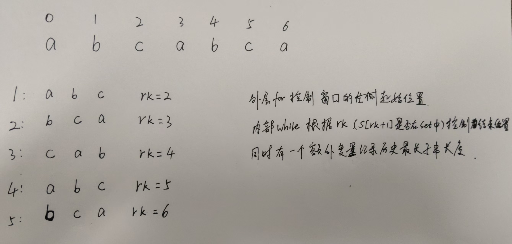

# 滑动窗口相关理解

## lc.3 无重复字符的最长字串

```cpp
class Solution {
public:
    int lengthOfLongestSubstring(string s) {
        unordered_set<char> cache;
        int n = s.size();

        int rk = -1, ans = 0;

        for(int i=0;i<n;++i)
        {
            if(i != 0)
            {
                cache.erase(s[i-1]);	//控制滑动窗口的起始位置，依次向后滑动一个位置
            }

            while(rk + 1 < n && !cache.count(s[rk+1]))	//控制滑动窗口的终止位置，根据rk处的字符是否在set中判断
            {
                cache.insert(s[rk+1]);
                ++rk;
            }

            ans = max(ans, rk - i + 1);
        }

        return ans;
    }
};
```




## lc.438 找到字符串中所有字母异位词

```cpp
class Solution {
public:
    vector<int> findAnagrams(string s, string p) {
        int ssize = s.size();
        int psize = p.size();
        if (ssize < psize) return {};

        vector<int> ret;
        array<int, 26> pcache{}, scache{};

        for (char c : p) ++pcache[c - 'a'];

        int rk = -1; // 窗口右端点，窗口为 [i, rk]

        for (int i = 0; i < ssize; ++i) 
        {
            if(i != 0) --scache[s[i-1] - 'a'];

            // 保证窗口长度最多为 m：不断右扩直到长度达到 m 或 rk 到头
            while (rk + 1 < ssize && rk - i + 1 < psize) {
                ++rk;
                ++scache[s[rk] - 'a'];
            }

            // 只有窗口长度恰好为 m 才比较
            if (rk - i + 1 == psize && scache == pcache) {
                ret.push_back(i);
            }
        }

        return ret;
    }
};
```

首先我倾向于类似算法采用相同的代码结构，这道题参考了上道题的代码结构，使用rk标记窗口右侧。

