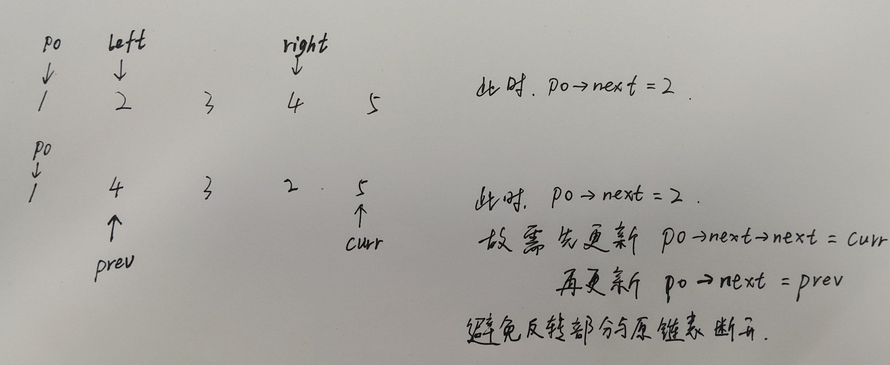
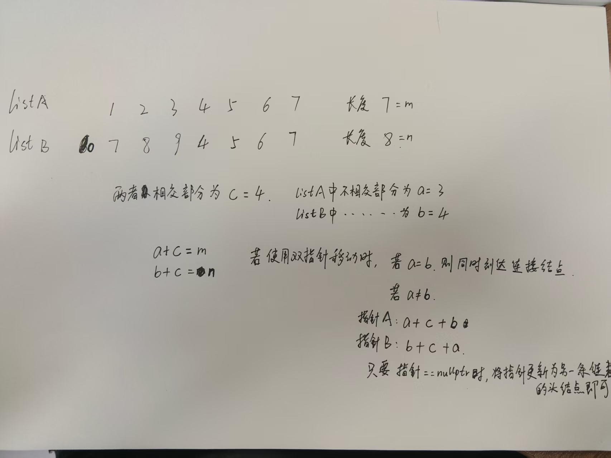
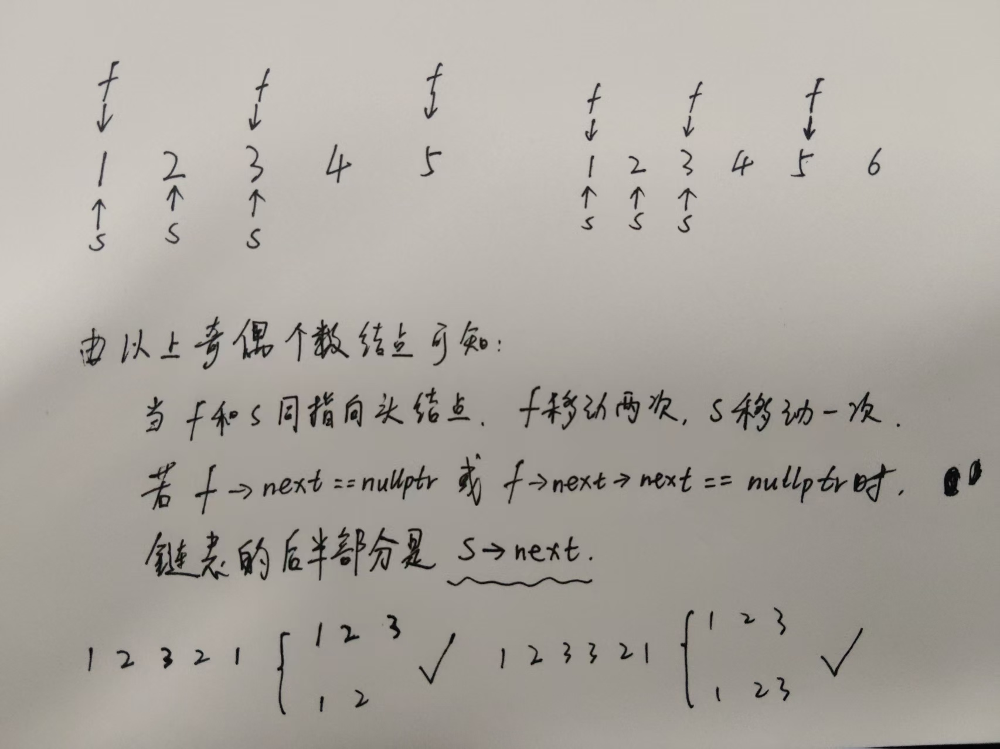
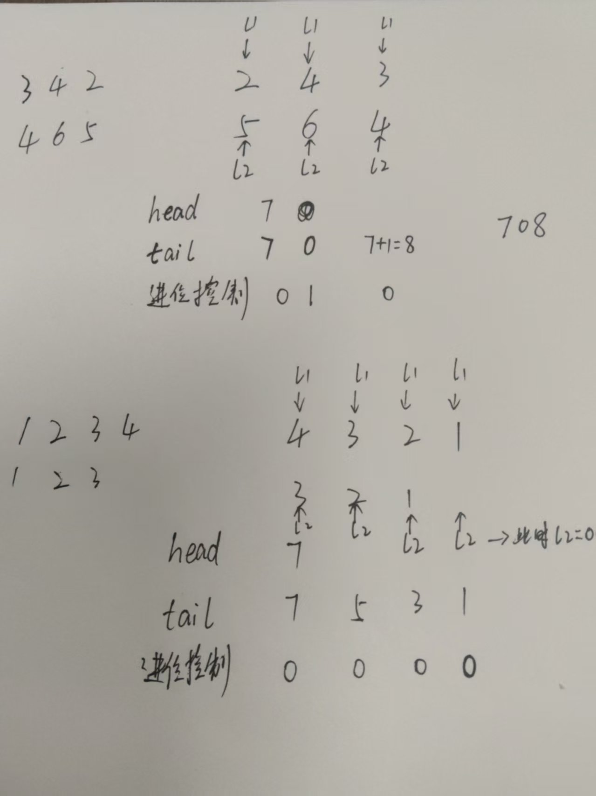
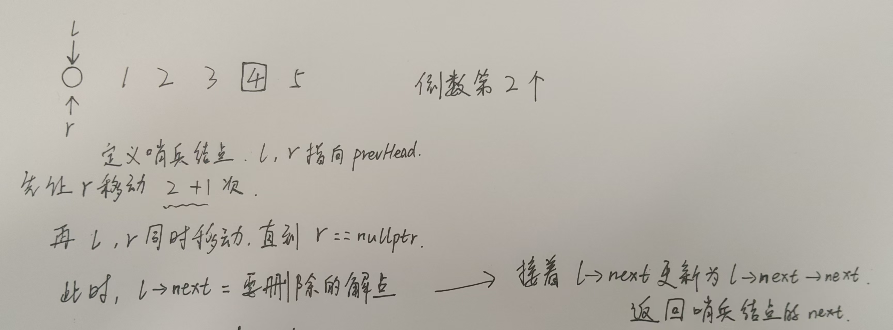
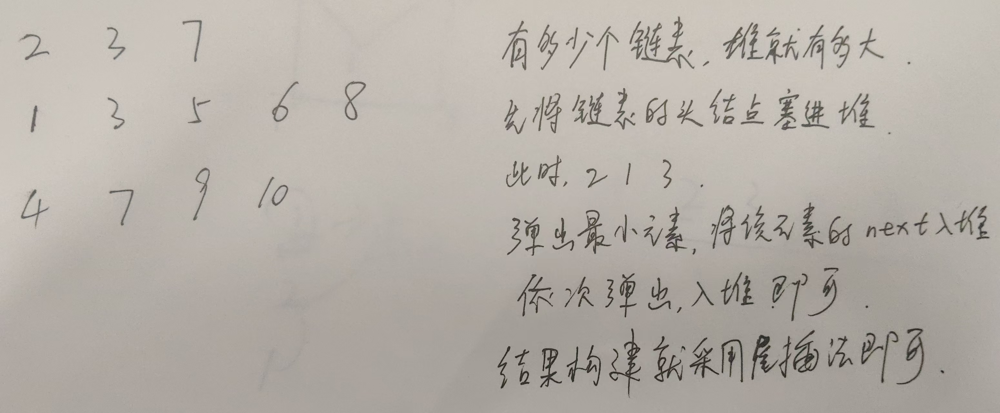
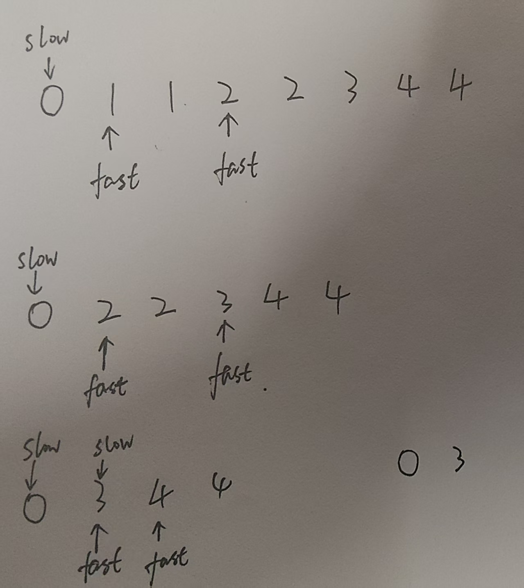

# 链表

## lc.206 反转链表

```cpp
/**
 * Definition for singly-linked list.
 * struct ListNode {
 *     int val;
 *     ListNode *next;
 *     ListNode() : val(0), next(nullptr) {}
 *     ListNode(int x) : val(x), next(nullptr) {}
 *     ListNode(int x, ListNode *next) : val(x), next(next) {}
 * };
 */
class Solution {
public:
    ListNode* reverseList(ListNode* head) {
        ListNode* prev = nullptr;
        ListNode* curr = head;

        while(curr)
        {
            ListNode* node = curr->next;
            curr->next = prev;
            prev = curr;
            curr = node;
        }

        return prev;
    }
};
```

**只需要记好while中的四个语句。**

根据while的判断条件，循环结束时curr总是指向反转部分的后一个结点，prev指向curr的前一个结点，这个特点在反转链表II中很重要。


## lc.96 反转链表II

```cpp
/**
 * Definition for singly-linked list.
 * struct ListNode {
 *     int val;
 *     ListNode *next;
 *     ListNode() : val(0), next(nullptr) {}
 *     ListNode(int x) : val(x), next(nullptr) {}
 *     ListNode(int x, ListNode *next) : val(x), next(next) {}
 * };
 */
class Solution {
public:
    ListNode* reverseBetween(ListNode* head, int left, int right) {
        ListNode* prevHead = new ListNode(-1);
        prevHead->next = head;
        ListNode* p0 = prevHead;

        for(int i=0;i<left-1;++i)
        {
            p0 = p0->next;    //找第left-1个结点
        }

        ListNode* prev = nullptr;
        ListNode* curr = p0->next;

        for(int i=0;i<right-left+1;++i)
        {
            ListNode* node = curr->next;
            curr->next = prev;
            prev = curr;
            curr = node;
        }

        p0->next->next = curr;
        p0->next = prev;

        return prevHead->next;
    }
};
```

关键点：

​	根据反转链表I可知，当使用**四个固定代码**进行反转时，curr指向第right+1个结点，prev指向反转后的(反转部分)头结点。

​	

​	需要记录反转部分的前一个结点p0

​	需要将反转部分的结点遍历完

​	将p0->next->next = curr, p0->next = prev, 二者顺序不能改变

​	因为p0是反转部分的前一个结点，故找p0时是第left-1个。而反转操作中，使用right-left+1是为了保证反转部分的所有结点都会被反转，不漏结点。


## lc.25 K 个一组翻转链表

```cpp
/**
 * Definition for singly-linked list.
 * struct ListNode {
 *     int val;
 *     ListNode *next;
 *     ListNode() : val(0), next(nullptr) {}
 *     ListNode(int x) : val(x), next(nullptr) {}
 *     ListNode(int x, ListNode *next) : val(x), next(next) {}
 * };
 */
class Solution {
public:

    // p0:  待反转区间的前驱节点
    // end: 待反转区间的最后一个节点（第k个）
    // 反转 (p0, end] 之间的节点，返回反转后该组的尾节点（即下一组的p0）
    ListNode* reverse(ListNode* p0, ListNode* end)
    {
        ListNode* nextp0 = p0->next;        // 原区间头节点，反转后变为尾节点

        ListNode* endNext = end->next;      // ✅ 提前保存end->next，防止反转过程中被修改
        ListNode* prev = endNext;           // prev初始化为end的后继，保证尾节点next正确接续
        ListNode* curr = p0->next;          // curr从区间头节点开始

        while(curr != endNext)              // ✅ 用提前保存的endNext做终止条件，不受反转影响
        {
            ListNode* node = curr->next;
            curr->next = prev;
            prev = curr;
            curr = node;
        }

        p0->next = prev;                    // p0连接反转后的新头（即原来的end）
        // nextp0->next已经在循环中被正确设置为end->next（原后继）

        return nextp0;                      // 返回下一个k组的p0（原区间头=反转后的尾）
    }

    ListNode* reverseKGroup(ListNode* head, int k) {
        if(head == nullptr || k <= 1) return head;
    
        ListNode* prevHead = new ListNode(-1);
        prevHead->next = head;

        ListNode* p0 = prevHead;
        ListNode* move = prevHead;          // ✅ move从哑节点开始，方便找到第k个节点

        while(move)
        {
            // 向后走k步，找到当前组的end（第k个节点）
            for(int i = 0; i < k; ++i)
            {
                move = move->next;
                if(move == nullptr)         // ✅ 不足k个节点，直接返回
                    return prevHead->next;
            }
            // 此时move指向当前组最后一个节点（end）
            p0 = reverse(p0, move);
            // reverse返回新的p0（下一组的前驱），move也已到达正确位置（等于p0）
            move = p0;
        }
        
        return prevHead->next;              // ✅ 返回哑节点的next，而非原head
    }
};
```

这道题检验反转链表相关的所有知识


## lc.160 相交链表

```cpp
/**
 * Definition for singly-linked list.
 * struct ListNode {
 *     int val;
 *     ListNode *next;
 *     ListNode(int x) : val(x), next(NULL) {}
 * };
 */
class Solution {
public:
    ListNode *getIntersectionNode(ListNode *headA, ListNode *headB) {
        ListNode* pA = headA;
        ListNode* pB = headB;
        while(pA != pB)
        {
            pA = pA == nullptr ? headB : pA->next;
            pB = pB == nullptr ? headA : pB->next;
        }
        return pA;
    }
};
```




## lc.234 回文链表

```cpp
/**
 * Definition for singly-linked list.
 * struct ListNode {
 *     int val;
 *     ListNode *next;
 *     ListNode() : val(0), next(nullptr) {}
 *     ListNode(int x) : val(x), next(nullptr) {}
 *     ListNode(int x, ListNode *next) : val(x), next(next) {}
 * };
 */
class Solution {
public:

    ListNode* reverse(ListNode* head)
    {
        ListNode* prev = nullptr;
        ListNode* curr = head;

        while(curr)
        {
            ListNode* node = curr->next;
            curr->next = prev;
            prev = curr;
            curr = node;
        }

        return prev;
    }

    bool isPalindrome(ListNode* head) 
    {
        if(head->next == nullptr) return true;

        ListNode* slow = head;
        ListNode* fast = head;

        while(fast->next && fast->next->next)
        {
            slow = slow->next;
            fast = fast->next->next;
        }

        ListNode* newHead = slow->next;
        slow->next = nullptr;   //注意这里的分割链表操作。将原链表与反转部分的链表分割

        newHead = reverse(newHead);

        ListNode* pa = head;
        ListNode* pb = newHead;

        while(pa && pb)
        {
            if(pa->val != pb->val) return false;

            pa = pa->next;
            pb = pb->next;
        }

        return true;
    }
};
```

该题主要分为两部分：

​	1、反转中间结点以后的结点，即反转部分是后半段链表

​	2、使用双指针将前半部分链表与后半段链表进行比较

怎么找出后半段链表？




## lc.141 环形链表

```cpp
/**
 * Definition for singly-linked list.
 * struct ListNode {
 *     int val;
 *     ListNode *next;
 *     ListNode(int x) : val(x), next(NULL) {}
 * };
 */
class Solution {
public:
    bool hasCycle(ListNode *head) {
        if(head == nullptr) return false;
        
        ListNode* slow = head;
        ListNode* fast = head;

        while(fast && fast->next)
        {
            slow = slow->next;
            fast = fast->next->next;
            if(slow == fast) return true;
        }

        return false;
    }
};
```

**Floyd 判圈算法**，又称**龟兔赛跑算法**，是一种用于判断链表、迭代函数或有限状态机中是否存在环的算法。该算法还可以找到环的起点并计算环的长度。

算法思想

Floyd 判圈算法的核心思想是使用两个指针：一个快指针和一个慢指针。快指针每次移动两步，慢指针每次移动一步。如果链表中存在环，那么在有限时间内，快慢指针必然会在环上相遇。

**判断是否有环**

判断是否有环的步骤如下：

1. 初始化快指针和慢指针，均指向链表的起点。
2. 快指针每次移动两步，慢指针每次移动一步。
3. 如果快指针和慢指针在有限时间内相遇，则链表中存在环；否则，不存在环。

**找到环的起点**

找到环的起点的步骤如下：

1. 当快慢指针相遇时，将慢指针重新指向链表的起点，快指针保持在相遇点。
2. 快慢指针每次均移动一步，当它们再次相遇时，相遇点即为环的起点。

**计算环的长度**

计算环的长度的步骤如下：

1. 当快慢指针在环上相遇时，记录相遇点。
2. 从相遇点开始，快指针每次移动一步，直到再次回到相遇点，移动的步数即为环的长度。

## lc.21 合并两个升序链表

```cpp
/**
 * Definition for singly-linked list.
 * struct ListNode {
 *     int val;
 *     ListNode *next;
 *     ListNode() : val(0), next(nullptr) {}
 *     ListNode(int x) : val(x), next(nullptr) {}
 *     ListNode(int x, ListNode *next) : val(x), next(next) {}
 * };
 */
class Solution {
public:
    ListNode* mergeTwoLists(ListNode* list1, ListNode* list2) {
        ListNode* prevHead = new ListNode(-1);
        ListNode* prev = prevHead;

        while(list1 && list2)
        {
            if(list1->val <= list2->val)
            {
                prev->next = list1;
                prev = list1;
                list1 = list1->next;
            }
            else
            {
                prev->next = list2;
                prev = list2;
                list2 = list2->next;
            }
        }

        if(list1) prev->next = list1;
        if(list2) prev->next = list2;

        return prevHead->next;
    }
};
```

谁小，prev->next指向谁，接着更新prev和list


## lc.2 两数相加

```cpp
/**
 * Definition for singly-linked list.
 * struct ListNode {
 *     int val;
 *     ListNode *next;
 *     ListNode() : val(0), next(nullptr) {}
 *     ListNode(int x) : val(x), next(nullptr) {}
 *     ListNode(int x, ListNode *next) : val(x), next(next) {}
 * };
 */
class Solution {
public:
    ListNode* addTwoNumbers(ListNode* l1, ListNode* l2) {
        ListNode* head = nullptr;
        ListNode* tail = nullptr;

        int add = 0;

        while(l1 || l2)
        {
            int n1 = l1 != nullptr ? l1->val : 0;
            int n2 = l2 != nullptr ? l2->val : 0;

            int sum = n1 + n2 + add;

            if(sum > 9)
            {
                add = 1;
                sum = sum % 10;
            }
            else
            {
                add = 0;
            }

            if(head == nullptr)
            {
                head = new ListNode(sum);
                tail = head;
            }
            else
            {
                ListNode* node = new ListNode(sum);
                tail->next = node;
                tail = node;
            }

            if(l1) l1 = l1->next;
            if(l2) l2 = l2->next;
        }

        if(add)
        {
            ListNode* node = new ListNode(add);
            tail->next = node;
        }

        return head;
    }
};
```

主要是进位控制




## lc.19 删除链表的倒数第 N 个结点

```cpp
/**
 * Definition for singly-linked list.
 * struct ListNode {
 *     int val;
 *     ListNode *next;
 *     ListNode() : val(0), next(nullptr) {}
 *     ListNode(int x) : val(x), next(nullptr) {}
 *     ListNode(int x, ListNode *next) : val(x), next(next) {}
 * };
 */
class Solution {
public:
    ListNode* removeNthFromEnd(ListNode* head, int n) {
        if(head == nullptr) return head;

        ListNode* prevHead = new ListNode(0);
        prevHead->next = head;

        ListNode* left = prevHead;
        ListNode* right = prevHead;

        for(int i=0;i<n+1;++i)
        {
            right = right->next;
        }

        while(right)
        {
            left = left->next;
            right = right->next;
        }

        ListNode* node = left->next;
        left->next = node->next;

        delete node;
        
        return prevHead->next;
    }
};
```




lc.24 两两交换链表中的结点

```cpp
/**
 * Definition for singly-linked list.
 * struct ListNode {
 *     int val;
 *     ListNode *next;
 *     ListNode() : val(0), next(nullptr) {}
 *     ListNode(int x) : val(x), next(nullptr) {}
 *     ListNode(int x, ListNode *next) : val(x), next(next) {}
 * };
 */
class Solution {
public:
    ListNode* swapPairs(ListNode* head) {
        if(head == nullptr) return head;

        ListNode* left = head;
        ListNode* right = head->next;

        while(left && right)
        {
            int x = left->val;
            left->val = right->val;
            right->val = x;

            left = right->next;
            if(left) right = left->next;
        }

        return head;
    }
};
```

left在前，right在后，依次交换val。直到left或right中有一个为空。


## lc.138 随机链表的复制

```cpp
/*
// Definition for a Node.
class Node {
public:
    int val;
    Node* next;
    Node* random;
    
    Node(int _val) {
        val = _val;
        next = NULL;
        random = NULL;
    }
};
*/
class Solution {
public:
    Node* copyRandomList(Node* head) {
        if(head == nullptr)
        {
            return nullptr;
        }
        
        //对原链表，每个结点后构造其本身结点，形成1->1'->2->2'...的链表格式
        for(Node* node = head; node != nullptr; node = node->next->next)
        {
            Node* newnode = new Node(node->val);
            newnode->next = node->next;
            node->next = newnode;
        }

        //对参杂新旧结点的链表，根据旧结点中的random指针将新结点的random指向正确位置
        for(Node* node = head; node!=nullptr; node = node->next->next)
        {
            Node* newnode = node->next;
            newnode->random = (node->random != nullptr) ? node->random->next : nullptr;
        }

        //将新旧链表拆分，旧结点链表和新结点链表分开
        Node* newHead = head->next; //新链表的头结点
        for(Node* node = head; node!=nullptr; node = node->next)    //注意这里应该是一个next，只遍历旧结点
        {
            Node* newnode = node->next;
            node->next = node->next->next;
            newnode->next = (newnode->next != nullptr) ? newnode->next->next : nullptr;
        }

        return newHead;
    }
};
```

这道题就是纯粹的链表结构控制，非常纯粹。


## lc.148 排序链表

```cpp
/**
 * Definition for singly-linked list.
 * struct ListNode {
 *     int val;
 *     ListNode *next;
 *     ListNode() : val(0), next(nullptr) {}
 *     ListNode(int x) : val(x), next(nullptr) {}
 *     ListNode(int x, ListNode *next) : val(x), next(next) {}
 * };
 */
class Solution {
public:
    ListNode* split(ListNode* head)
    {
        if(head == nullptr) return head;
        
        ListNode* slow = head;
        ListNode* fast = head;

        while(fast->next && fast->next->next)
        {
            slow = slow->next;
            fast = fast->next->next;
        }

        ListNode* mid = slow->next;
        slow->next = nullptr;
        return mid;
    }

    ListNode* merge(ListNode* list1, ListNode* list2)   //合并有序链表
    {
        ListNode* prevHead = new ListNode(0);
        ListNode* prev = prevHead;

        while(list1 && list2)
        {
            if(list1->val <= list2->val)
            {
                prev->next = list1;
                prev = list1;
                list1 = list1->next;
            }
            else
            {
                prev->next = list2;
                prev = list2;
                list2 = list2->next;
            }
        }

        if(list1) prev->next = list1;
        if(list2) prev->next = list2;

        return prevHead->next;
    }

    ListNode* sortList(ListNode* head) 
    {
        if(head == nullptr || head->next == nullptr) return head;

        ListNode* head1 = head;
        ListNode* head2 = split(head);		//分割当前链表
        ListNode* list1 = sortList(head1);  //调用递归函数，继续分割当前链表的前半部分
        ListNode* list2 = sortList(head2);	//调用递归函数，继续分割当前链表的后半部分

        return merge(list1, list2);			//排序
    }
};
```

lc.234 + lc.21 的结合体
当前题目的难点是归并排序的思路。


## lc.23 合并K个升序链表  （典型的TopK问题）

```cpp
/**
 * Definition for singly-linked list.
 * struct ListNode {
 *     int val;
 *     ListNode *next;
 *     ListNode() : val(0), next(nullptr) {}
 *     ListNode(int x) : val(x), next(nullptr) {}
 *     ListNode(int x, ListNode *next) : val(x), next(next) {}
 * };
 */
class Solution {
public:
    struct comp{
        bool operator()(const ListNode* a, const ListNode* b)
        {
            return a->val > b->val;
        }
    };

    ListNode* mergeKLists(vector<ListNode*>& lists) {
        int k = lists.size();

        for(int i=0;i<k;++i)
        {
            if(lists[i])            //保证堆中的结点不为空，因为需要比较
                Q.push(lists[i]);
        }

        ListNode* head = nullptr;
        ListNode* tail = nullptr;
        while(!Q.empty())
        {
            ListNode* node = Q.top();
            Q.pop();

            if(head == nullptr)
            {
                head = node;
                tail = head;
            }
            else
            {
                tail->next = node;
                tail = node;
            }

            if(node->next)          //保证堆中的结点不为空，因为需要比较
            {
                Q.push(node->next);
            }
        }      

        return head;  
    }

    std::priority_queue<ListNode*, std::vector<ListNode*>, comp> Q;
};
```



**入堆的结点必须不为空，否则比较器无法工作**


## lc.146 LRU缓存

```cpp
class LRUCache {
public:
    LRUCache(int capacity_) : capacity(capacity_), size(0), head(new Node()), tail(new Node()) 
    {
        head->next = tail;
        tail->prev = head;
    }
    
    int get(int key) 
    {
        auto it = cache.find(key);
        if(it != cache.end())
        {
            Node* node = it->second;
            MoveToHead(node);
            return node->val;
        }

        return -1;
    }
    
    void put(int key, int value) 
    {
        auto it = cache.find(key);
        if(it != cache.end())
        {
            Node* node = it->second;
            node->val = value;
            MoveToHead(node);
        }
        else
        {
            Node* node = new Node(key, value);
            AddToHead(node);
            cache[key] = node;
            ++size;

            if(size > capacity)
            {
                Node* node = RemoveTail();
                cache.erase(node->key);
                delete node;

                --size;
            }
        }
    }

    struct Node{
        Node() {}
        Node(int key_, int val_) : key(key_), val(val_), prev(nullptr), next(nullptr) {}

        int key;
        int val;
        Node* prev;
        Node* next;
    };

    void AddToHead(Node* node)
    {
        Node* temp = head->next;
        temp->prev = node;
        node->next = temp;
        head->next = node;
        node->prev = head;
    }

    void Remove(Node* node)
    {
        node->prev->next = node->next;
        node->next->prev = node->prev;
    }

    Node* RemoveTail()
    {
        Node* node = tail->prev;
        Remove(node);
        return node;
    }

    void MoveToHead(Node* node)
    {
        Remove(node);
        AddToHead(node);
    }

    int capacity;
    int size;
    Node* head;
    Node* tail;    
    std::unordered_map<int, Node*> cache;
};

/**
 * Your LRUCache object will be instantiated and called as such:
 * LRUCache* obj = new LRUCache(capacity);
 * int param_1 = obj->get(key);
 * obj->put(key,value);
 */
```

双链表+哈希表实现LRU

**只要使用node，就把该结点放到双链表的第一个位置。当结点个数超出指定缓存数时，去掉末尾的结点**

添加node，就把node放到双链表的第一个位置。若已经存在该node(根据key去哈希表查找，key唯一)，更改node的val，放到双链表的第一个位置。

如果添加之后，双链表结点个数大于指定个数，就将末尾结点从双链表和哈希表中删除，接着delete掉

这个理解思想，然后多刷就ok


## lc.82 删除排序链表中的重复元素II

```cpp
/**
 * Definition for singly-linked list.
 * struct ListNode {
 *     int val;
 *     ListNode *next;
 *     ListNode() : val(0), next(nullptr) {}
 *     ListNode(int x) : val(x), next(nullptr) {}
 *     ListNode(int x, ListNode *next) : val(x), next(next) {}
 * };
 */
class Solution {
public:
    ListNode* deleteDuplicates(ListNode* head) {
        ListNode* dummyHead = new ListNode(0, head);
        ListNode* fast = head;
        ListNode* slow = dummyHead;
        while (fast && fast->next) {
            if (fast->val == fast->next->val) {
                int x = fast->val;
                while (fast && fast->val == x) {
                    ListNode* node = fast;
                    fast = fast->next;
                    delete node;
                }
                slow->next = fast;
            } else {
                fast = fast->next;
                slow = slow->next;
            }
        }
        return dummyHead->next;
    }
};
```



注意fast的删除逻辑，这道题需要好好看。


## lc.61 旋转链表

```cpp
/**
 * Definition for singly-linked list.
 * struct ListNode {
 *     int val;
 *     ListNode *next;
 *     ListNode() : val(0), next(nullptr) {}
 *     ListNode(int x) : val(x), next(nullptr) {}
 *     ListNode(int x, ListNode *next) : val(x), next(next) {}
 * };
 */
class Solution {
public:
    ListNode* rotateRight(ListNode* head, int k) {
        if(head == nullptr || head->next == nullptr || k < 1) return head;

        ListNode* last = head;

        int n = 1;
        while(last->next)   //遍历到尾结点，同时记录结点个数
        {
            ++n;
            last = last->next;
        }

        int move = n - k % n;   //判断在原链表上需要移动多少次满足移动K次的条件
        if(move == n)   return head;

        last->next = head;  //将尾结点连接到头结点，形成环
        while(move)
        {
            last = last->next;  //将last移动move次，此时last->next就是新的头结点
        	--move;
        }

        ListNode* newHead = last->next;
        last->next = nullptr;   //断开last，形成新的尾结点
        
        return newHead;
    }
};
```

需要注意计算公式：**n-k%n**


## lc.86 分隔链表

```cpp
/**
 * Definition for singly-linked list.
 * struct ListNode {
 *     int val;
 *     ListNode *next;
 *     ListNode() : val(0), next(nullptr) {}
 *     ListNode(int x) : val(x), next(nullptr) {}
 *     ListNode(int x, ListNode *next) : val(x), next(next) {}
 * };
 */
class Solution {
public:
    ListNode* partition(ListNode* head, int x) {
        ListNode* small = nullptr;
        ListNode* big = nullptr;

        ListNode* small_tail = nullptr;
        ListNode* big_tail = nullptr;

        while(head)
        {
            if(head->val < x)
            {
                if(!small)
                {
                    small = head;
                    small_tail = small;
                }
                else
                {
                    small_tail->next = head;
                    small_tail = head;
                }
            }
            else
            {
                if(!big)
                {
                    big = head;
                    big_tail = big;
                }
                else
                {
                    big_tail->next = head;
                    big_tail = head;
                }
            }

            head = head->next;
        }

        if(small_tail) small_tail->next = big;
        if(big_tail) big_tail->next = nullptr;

        return small ? small : big;
    }
};
```

将链表拆成两个链表，简单的尾插法。

需要注意**有可能不存在小于x的链表或大于等于x的链表**，所以最后需要判断。